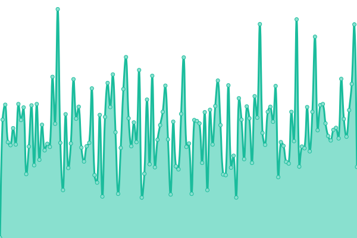
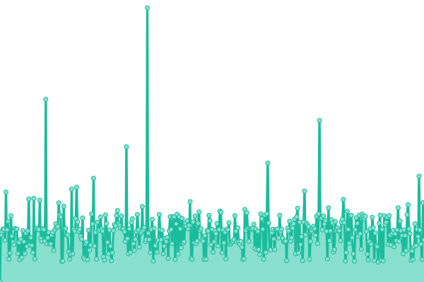
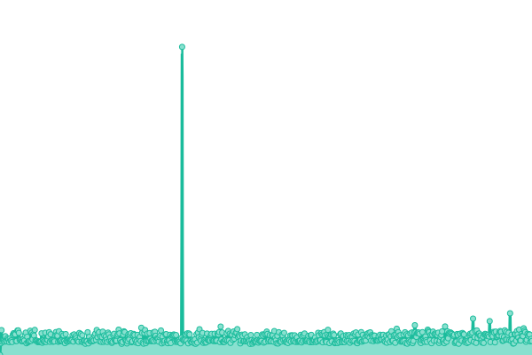
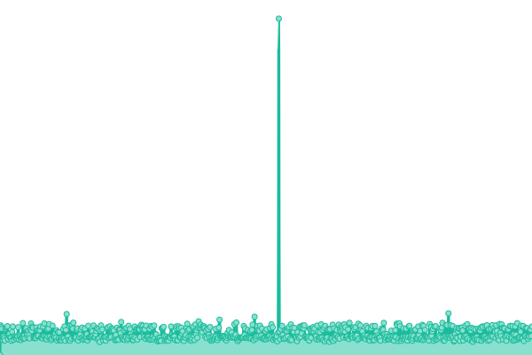
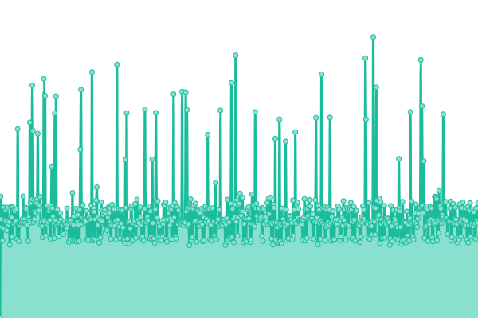

# [📈 Live Status](https://demo.upptime.js.org): <!--live status--> **🟧 Partial outage**

This repository contains the open-source uptime monitor and status page for [Upptime](https://upptime.js.org), powered by [Upptime](https://github.com/upptime/upptime).

With [Upptime](https://upptime.js.org), you can get your own unlimited and free uptime monitor and status page, powered entirely by a GitHub repository. We use [Issues](https://github.com/upptime/upptime/issues) as incident reports, [Actions](https://github.com/truongsinh/upptime.truongsinh.pro/actions) as uptime monitors, and [Pages](https://demo.upptime.js.org) for the status page.

<!--start: status pages-->
<!-- This summary is generated by Upptime (https://github.com/upptime/upptime) -->
<!-- Do not edit this manually, your changes will be overwritten -->
<!-- prettier-ignore -->
| URL | Status | History | Response Time | Uptime |
| --- | ------ | ------- | ------------- | ------ |
|  [Photos](https://photos.truongsinh.pro) | 🟩 Up | [photos.yml](https://github.com/truongsinh/upptime.truongsinh.pro/commits/HEAD/history/photos.yml) | 

 331ms
     
 | 

<a href="https://upptime.truongsinh.pro/history/photos">40.81%</a>
    

|  [thorton](https://photos.thornton.truongsinh.pro) | 🟩 Up | [thorton.yml](https://github.com/truongsinh/upptime.truongsinh.pro/commits/HEAD/history/thorton.yml) | 

 239ms
     
 | 

<a href="https://upptime.truongsinh.pro/history/thorton">79.48%</a>
    

|  [avenida](https://photos.avenida.truongsinh.pro) | 🟩 Up | [avenida.yml](https://github.com/truongsinh/upptime.truongsinh.pro/commits/HEAD/history/avenida.yml) | 

 288ms
     
 | 

<a href="https://upptime.truongsinh.pro/history/avenida">29.68%</a>
    

|  [dns.avenida](https://dns.avenida.truongsinh.pro/ready) | 🟩 Up | [dns-avenida.yml](https://github.com/truongsinh/upptime.truongsinh.pro/commits/HEAD/history/dns-avenida.yml) | 

 295ms
     
 | 

<a href="https://upptime.truongsinh.pro/history/dns-avenida">40.86%</a>
    

|  [pnt](https://photos.pnt.truongsinh.pro) | 🟥 Down | [pnt.yml](https://github.com/truongsinh/upptime.truongsinh.pro/commits/HEAD/history/pnt.yml) | 

 1604ms
     
 | 

<a href="https://upptime.truongsinh.pro/history/pnt">0.00%</a>
    

<!--end: status pages-->

[**Visit our status website →**](https://demo.upptime.js.org)

## 📄 License

- Powered by: [Upptime](https://github.com/upptime/upptime)
- Code: [MIT](./LICENSE) © [Upptime](https://upptime.js.org)
- Data in the `./history` directory: [Open Database License](https://opendatacommons.org/licenses/odbl/1-0/)
